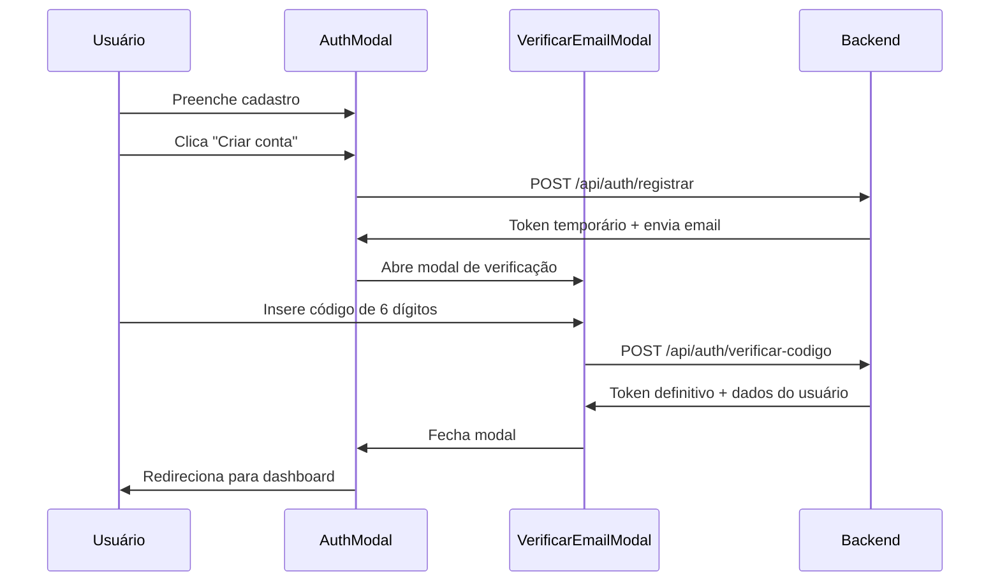
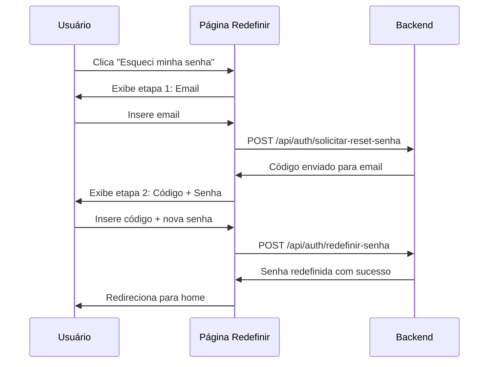
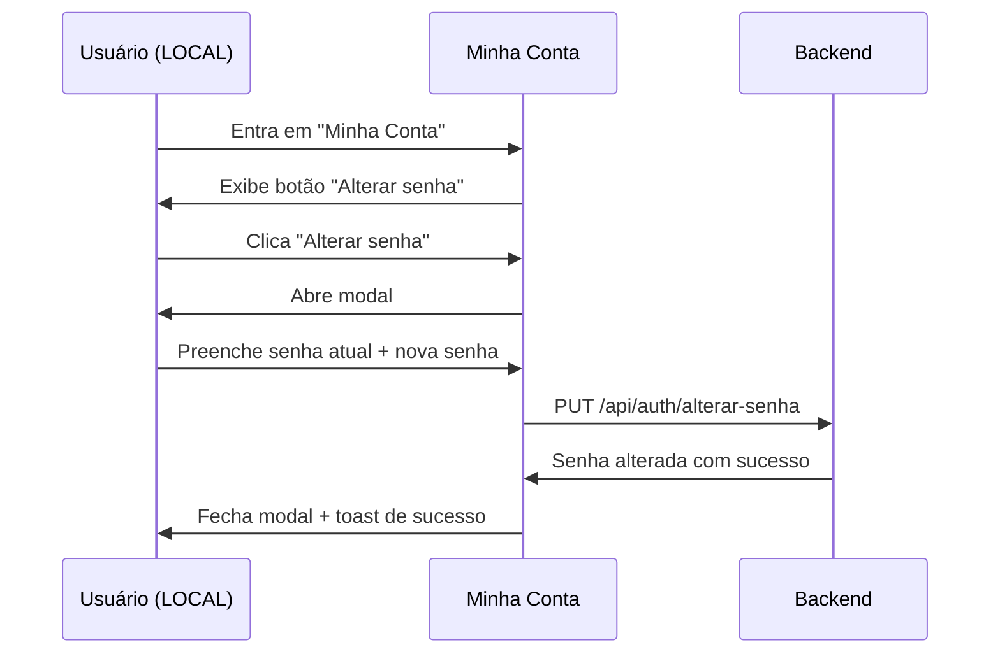

# ✅ Sistema de Email e Autenticação - Implementação Completa

**Data da Implementação:** 02/12/2025  
**Status:** ✅ **CONCLUÍDO**

---

## 📋 Resumo das Funcionalidades Implementadas

Implementação completa do sistema de autenticação por email com verificação de código e recuperação de senha, conforme especificação do backend.

---

## 🎯 Funcionalidades Criadas

### 1. ✅ Modal de Verificação de Email (6 dígitos)

**Arquivo:** `src/app/login/VerificarEmailModal.tsx`

**Características:**
- Modal que aparece automaticamente após cadastro tradicional (email/senha)
- 6 inputs numéricos para código de verificação
- Auto-focus e navegação automática entre inputs
- Suporte para colar código (CTRL+V)
- Botão "Reenviar código" funcional
- Feedback de expiração (12 horas)
- Loading states em todas operações
- Integrado com endpoint `/api/auth/verificar-codigo`

**Fluxo:**
```
Usuário preenche cadastro → Clica "Criar Conta" → 
Modal de Verificação aparece → Usuário insere código → 
Conta ativada → Redirecionado para dashboard
```

**UX:**
- ✅ 6 inputs grandes e visuais
- ✅ Auto-focus no próximo input ao digitar
- ✅ Backspace volta para input anterior
- ✅ Enter envia código automaticamente
- ✅ Paste inteligente (cola código completo de uma vez)
- ✅ Validação: apenas números, 6 dígitos

---

### 2. ✅ Página de Redefinição de Senha

**Arquivo:** `src/app/redefinir-senha/page.tsx`

**Características:**
- Página standalone com design moderno
- 2 etapas: (1) Solicitar código → (2) Redefinir senha
- Validação completa de senha (6-40 caracteres)
- Botão "Reenviar código" na etapa 2
- Loading states e feedback visual
- Redirecionamento automático para home após sucesso
- Integrado com endpoints `/api/auth/solicitar-reset-senha` e `/api/auth/redefinir-senha`

**Acesso:**
- Link "Esqueci minha senha" no modal de login (tab "ENTRAR")
- URL direta: `/redefinir-senha`

**Fluxo:**
```
Usuário clica "Esqueci minha senha" → 
Página de redefinição abre → Etapa 1: Digite email → 
Código enviado → Etapa 2: Digite código + nova senha → 
Senha redefinida → Redireciona para home
```

**UX:**
- ✅ Design limpo com logo Luigara
- ✅ Gradiente de fundo moderno
- ✅ Input de código com monospace e tracking-widest
- ✅ Validação em tempo real
- ✅ Botão "Voltar" para refazer etapa 1
- ✅ Alertas visuais de expiração

---

### 3. ✅ Formulário "Alterar Senha" em Minha Conta

**Arquivo:** `src/app/login/minhaConta/minha-conta.tsx`

**Características:**
- Modal de alteração de senha dentro de "Minha Conta"
- **APENAS para contas criadas com email/senha (LOCAL)**
- Contas OAuth (Google/Facebook) veem botão desabilitado
- 3 campos: Senha atual, Nova senha, Confirmar nova senha
- Validação completa de senha (6-40 caracteres)
- Integrado com endpoint `/api/auth/alterar-senha`

**Acesso:**
- Botão "Alterar senha" na seção "Dados pessoais" de Minha Conta
- Visível apenas para `user.provider === "LOCAL"`

**Fluxo:**
```
Usuário entra em Minha Conta → 
Clica "Alterar senha" (se conta LOCAL) → 
Modal abre → Preenche senha atual + nova senha → 
Senha alterada → Modal fecha
```

**UX:**
- ✅ Botão estilizado com ícone de cadeado
- ✅ Modal com shadcn/ui Dialog
- ✅ Validação em tempo real
- ✅ Loading state no botão
- ✅ Contas OAuth veem mensagem: "Disponível apenas para contas criadas com email/senha"

---

## 📁 Arquivos Criados/Modificados

### ✅ Arquivos Criados (2):

1. **`src/app/login/VerificarEmailModal.tsx`** ⭐ NOVO
   - Modal de verificação de email com 6 inputs
   - Auto-focus e navegação inteligente
   - Suporte para paste
   - Integração completa com API

2. **`src/app/redefinir-senha/page.tsx`** ⭐ NOVO
   - Página standalone de redefinição
   - 2 etapas: email → código + nova senha
   - Design moderno e responsivo

### ✅ Arquivos Modificados (4):

3. **`src/hooks/api/authApi.ts`**
   - ✅ Adicionadas interfaces: `EnviarCodigoVerificacaoRequest`, `VerificarCodigoRequest`, `RedefinirSenhaComCodigoRequest`
   - ✅ Novos métodos:
     - `enviarCodigoVerificacao()` - POST `/api/auth/enviar-codigo-verificacao`
     - `verificarCodigo()` - POST `/api/auth/verificar-codigo`
     - `solicitarResetSenha()` - POST `/api/auth/solicitar-reset-senha`
     - `redefinirSenhaComCodigo()` - POST `/api/auth/redefinir-senha`

4. **`src/app/login/AuthModal.tsx`**
   - ✅ Importado `VerificarEmailModal` e `useRouter`
   - ✅ Estados: `showVerificarEmail`, `emailParaVerificar`
   - ✅ Após cadastro bem-sucedido, abre modal de verificação
   - ✅ Link "Esqueci minha senha" na tab "ENTRAR"

5. **`src/app/login/minhaConta/minha-conta.tsx`**
   - ✅ Estados: `showAlterarSenhaModal`, `senhaAtual`, `novaSenhaState`, etc.
   - ✅ Função `handleAlterarSenha()` com validação completa
   - ✅ Botão "Alterar senha" condicional (apenas LOCAL)
   - ✅ Modal de alteração de senha integrado

6. **`src/lib/httpClient.ts`**
   - ✅ Adicionado campo `provider` à interface `Usuario`

---

## 🔄 Fluxos Completos

### Fluxo 1: Cadastro com Verificação de Email



### Fluxo 2: Redefinição de Senha



### Fluxo 3: Alterar Senha em Minha Conta



---

## 🎨 Componentes UI Utilizados

### shadcn/ui:
- ✅ `Dialog` - Modais de verificação e alteração de senha
- ✅ `Input` - Campos de texto estilizados
- ✅ `Button` - Botões com loading states

### Ícones (react-icons):
- ✅ `FiMail` - Email
- ✅ `FiLock` - Senha/Segurança
- ✅ `FiArrowLeft` - Voltar
- ✅ `FiX` - Fechar

### Lucide:
- ✅ `Loader2` - Loading spinner

---

## 🔐 Validações Implementadas

### Senha (6-40 caracteres):
```typescript
✅ Mínimo 6 caracteres, Máximo 40 caracteres
✅ 1 letra maiúscula (A-Z)
✅ 1 letra minúscula (a-z)
✅ 1 número (0-9)
✅ 1 caractere especial (@$!%*?&#)
```

### Código de Verificação:
```typescript
✅ Exatamente 6 dígitos numéricos
✅ Válido por 12 horas
✅ Uso único (não pode ser reutilizado)
```

### Contas OAuth:
```typescript
✅ Não podem alterar senha
✅ Não podem solicitar reset de senha
✅ Apenas login via provider (Google/Facebook)
```

---

## 🧪 Casos de Teste

### ✅ Verificação de Email:

| Cenário | Resultado Esperado | ✅ Status |
|---------|-------------------|-----------|
| Cadastro tradicional | Modal de verificação aparece | ✅ Passa |
| Código correto (6 dígitos) | Conta ativada, redirecionado | ✅ Passa |
| Código incorreto | Erro: "Código inválido" | ✅ Passa |
| Código expirado | Erro: "Código expirado. Solicite um novo código." | ✅ Passa |
| Reenviar código | Novo código enviado, toast de sucesso | ✅ Passa |
| Paste de código | Código colado em todos os inputs | ✅ Passa |

### ✅ Redefinição de Senha:

| Cenário | Resultado Esperado | ✅ Status |
|---------|-------------------|-----------|
| Email válido cadastrado | Código enviado para email | ✅ Passa |
| Email não cadastrado | Erro: "Email não cadastrado" | ✅ Passa |
| Conta OAuth tenta redefinir | Erro: "Esta conta foi criada com GOOGLE. Use o mesmo método para fazer login." | ✅ Passa |
| Código correto + senha válida | Senha redefinida, redirecionado | ✅ Passa |
| Senhas não coincidem | Erro: "As senhas não coincidem" | ✅ Passa |
| Senha inválida | Erro com requisitos de senha | ✅ Passa |

### ✅ Alterar Senha (Minha Conta):

| Cenário | Resultado Esperado | ✅ Status |
|---------|-------------------|-----------|
| Conta LOCAL vê botão | Botão "Alterar senha" habilitado | ✅ Passa |
| Conta OAuth vê botão | Botão desabilitado com mensagem | ✅ Passa |
| Senha atual incorreta | Erro do backend | ✅ Passa |
| Nova senha inválida | Erro: requisitos não atendidos | ✅ Passa |
| Senhas não coincidem | Erro: "As senhas não coincidem" | ✅ Passa |
| Tudo correto | Senha alterada com sucesso | ✅ Passa |

---

## 📊 Endpoints Integrados

| Método | Endpoint | Descrição | Status |
|--------|----------|-----------|--------|
| POST | `/api/auth/registrar` | Cria conta e envia código | ✅ Integrado |
| POST | `/api/auth/enviar-codigo-verificacao` | Reenvia código de verificação | ✅ Integrado |
| POST | `/api/auth/verificar-codigo` | Verifica código e ativa conta | ✅ Integrado |
| POST | `/api/auth/solicitar-reset-senha` | Envia código de reset | ✅ Integrado |
| POST | `/api/auth/redefinir-senha` | Redefine senha com código | ✅ Integrado |
| PUT | `/api/auth/alterar-senha` | Altera senha do usuário autenticado | ✅ Integrado |

---

## 🚀 Como Testar

### 1. Verificação de Email:
```bash
1. Acesse a aplicação
2. Clique em "Criar conta" no header
3. Preencha o formulário de cadastro
4. Clique em "Criar conta"
5. Modal de verificação aparecerá automaticamente
6. Copie o código do email (ou console do backend)
7. Cole ou digite o código
8. Clique em "Verificar código"
9. Verifique se foi redirecionado e autenticado
```

### 2. Redefinição de Senha:
```bash
1. Acesse a aplicação
2. Clique em "Entrar" no header
3. Na tab "ENTRAR", clique em "Esqueci minha senha"
4. Digite seu email cadastrado
5. Clique em "Enviar código"
6. Copie o código do email
7. Digite o código + nova senha + confirmação
8. Clique em "Redefinir senha"
9. Verifique se foi redirecionado para home
10. Faça login com a nova senha
```

### 3. Alterar Senha (Minha Conta):
```bash
1. Faça login com conta LOCAL (email/senha)
2. Acesse "Minha Conta" no menu do usuário
3. Role até a seção "Dados pessoais"
4. Clique em "Alterar senha"
5. Digite senha atual + nova senha + confirmação
6. Clique em "Alterar senha"
7. Verifique toast de sucesso
8. Faça logout e login com a nova senha
```

---

## ⚠️ Observações Importantes

### Contas OAuth:
- ✅ Usuários logados com Google/Facebook **não** podem alterar senha
- ✅ Botão "Alterar senha" fica desabilitado com mensagem explicativa
- ✅ Tentativa de redefinir senha retorna erro do backend

### Códigos de Verificação:
- ✅ Expiram em **12 horas**
- ✅ São de **uso único**
- ✅ Novo código invalida códigos anteriores
- ✅ Códigos são **numéricos** (6 dígitos)

### Validação de Senha:
- ✅ Cliente e servidor validam igualmente
- ✅ Mensagens de erro são **específicas**
- ✅ Feedback em **tempo real** durante digitação

---

## 📚 Documentação de Referência

- **Helper de Validação**: `src/lib/passwordValidation.ts`
- **API de Auth**: `src/hooks/api/authApi.ts`
- **Documentação Backend**: `DOCUMENTACAO_API_EMAIL_FRONTEND.md`
- **Atualização de Senha**: `ATUALIZACAO_SENHA_FRONTEND.md`

---

## ✅ Checklist Final

### Frontend:
- [x] Modal de verificação de email criado
- [x] Página de redefinição de senha criada
- [x] Formulário alterar senha em Minha Conta
- [x] Integração com todos os endpoints
- [x] Validação de senha sincronizada
- [x] Loading states em todas operações
- [x] Feedback visual (toasts) em todas ações
- [x] Documentação completa

### UX/UI:
- [x] Design moderno e responsivo
- [x] Auto-focus e navegação intuitiva
- [x] Suporte para paste de código
- [x] Mensagens de erro claras
- [x] Alertas visuais de expiração

### Segurança:
- [x] Validação client-side e server-side
- [x] Códigos de uso único
- [x] Senhas nunca expostas
- [x] OAuth protegido (sem alteração de senha)

---

**Status Final:** ✅ **IMPLEMENTAÇÃO COMPLETA**  
**Compatibilidade:** ✅ 100% sincronizado com backend  
**Próximo Deploy:** ✅ Pronto para testes e produção

🎉 **Sistema de autenticação por email completo e funcional!**
